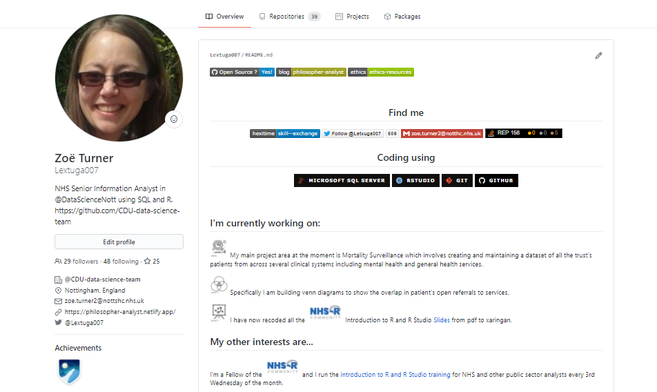
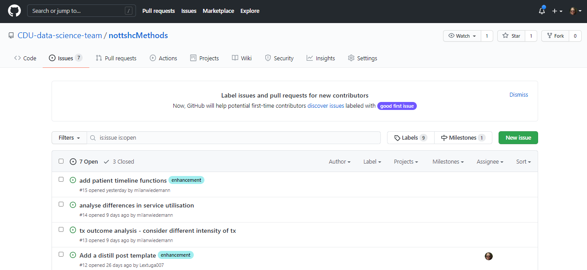

class: title-slide, left, bottom

```{r setup, include = FALSE}
library(knitr)
library(tidyverse)

### Packages not on CRAN ###

# install.packages("remotes")
# remotes::install_github("mitchelloharawild/icon")
library(icon) # icons need to be loaded to view so run following code if not already done
# icon::download_fontawesome()

# install.packages("devtools")
#devtools::install_github("gadenbuie/xaringanExtra")
library(xaringanExtra)
xaringanExtra::use_share_again() # need to get the slide button on html view
xaringanExtra::use_tachyons()

# install.packages("devtools")
# devtools::install_github('nhs-r-community/nhsrtheme')
library(nhsrtheme)


# set default options
opts_chunk$set(echo = FALSE,
               fig.width = 7.252,
               fig.height = 4,
               dpi = 300,
               dev.args = list(type = "cairo"),
               eval = TRUE,
               warning = FALSE,
               message = FALSE,
               error = FALSE)

# uncomment the following lines if you want to use the NHS-R theme colours by default
# scale_fill_continuous <- partial(scale_fill_nhs, discrete = FALSE)
# scale_fill_discrete <- partial(scale_fill_nhs, discrete = TRUE)
# scale_colour_continuous <- partial(scale_colour_nhs, discrete = FALSE)
# scale_colour_discrete <- partial(scale_colour_nhs, discrete = TRUE)

```

```{r echo=FALSE}
xaringanExtra::use_logo(
  image_url = "img/nottshc.PNG",
  exclude_class = c("title-slide", "inverse", "hide-logo"),
  width = "300px",
  height = "200px",
  position = css_position(top = "0em", right = "1em")
)

```


# `r rmarkdown::metadata$title`
----
## **`r rmarkdown::metadata$subtitle`**
### `r rmarkdown::metadata$author` | `r rmarkdown::metadata$date`
</br>

---
class: inverse, middle, center


# What this talk will NOT cover...

How to set up an account

--

not that much about version control either

--

it's not going to be all that technical... 

---

class: inverse-white, middle, center

# What is GitHub?

### "The code is on my Github repo"


---

# Who uses this (or should do)

* Analysts
* Data Scientists
* Academics
* [Teams](https://github.com/CDU-data-science-team)
* [Organisations](https://github.com/nhs-r-community)

--

# What does not go into it (or shouldn't do)?

* Large files
* Passwords
* Outputs (sometimes)
* Anything patient identifiable 

---

class: inverse-white

## This is what a new account looks like

<a href="https://github.com/Letxuga007" target="_blank"></a>

---

class: inverse-white

## This is what it could look like

<a href="https://github.com/Lextuga007" target="_blank"></a>

---

class: inverse, middle, center

# Looking for something?

---

class: inverse-white

# Searching GitHub

### By user/organisation

On an account repositories can be searched here:

.b--black.ba.bw1.br2.shadow-5.ph4.mt3[

]

---

class: inverse-white

# Searching GitHub

### Global search

.b--black.ba.bw1.br2.shadow-5.ph4.mt3[

]

---

### Search for NHS Number

Prompts to define by the user/organisation or in the whole of GitHub

.b--black.ba.bw1.br2.shadow-5.ph4.mt5[

]

---

class: inverse-white

### And this is what you get

.b--black.ba.bw1.br2.shadow-5.ph4.mt2[

]

---
class: inverse-white

## Like all searches...

Beware of spaces. 

"NHS Number" gets 2 repositories for R but "NHSNumber" with no space gets 3 different and perhaps more useful repos

.b--black.ba.bw1.br2.shadow-5.ph4.mt2[

]

---

class: inverse, middle, center

# From the beginning 

---

# Start with finding a user

Looking for my own repository Lextugao007

<iframe width="560" height="315" src="https://www.youtube.com/embed/_I-TqT6R810" title="Finding a user on GitHub without logging in" frameborder="0" allow="accelerometer; autoplay; clipboard-write; encrypted-media; gyroscope; picture-in-picture" allowfullscreen></iframe>

---

# Filter repositories

.b--black.ba.bw1.br2.shadow-5.ph4.mt5[

]
---

class: inverse, middle, center

# Other terminology

---

class: inverse-white

# Other terminology

#### related to copying a repository

.green[Fork] - appears on my GitHub and I can make changes to that copy

.b--black.ba.bw1.br2.shadow-5.ph4.mt2[

]

---

# Other terminology

#### related to copying a repository

.green[Clones] - doesn't appear on my GitHub and I can't make changes to the original without permission

.b--black.ba.bw1.br2.shadow-5.ph4.mt2[

]

---

class: inverse, middle, center

# The importance of having a README

---

class:inverse-white

# It's like a greeting to your repository

Or like the cover of a book - what is in here, why is it here, what was I thinking?

.b--black.ba.bw1.br2.shadow-5.ph4.mt2[
<a href="https://github.com/CDU-data-science-team/nottshcPublic" target="_blank"></a>
]
---

class: inverse-white

# It might even be the book

A repository of READMEs

.b--black.ba.bw1.br2.shadow-5.ph4.mt2[
<a href="https://github.com/matiassingers/awesome-readme" target="_blank"></a>
]

---

class: inverse, middle, center

# A place for code notes

---

# Gist (or quick code)

<iframe width="560" height="315" src="https://www.youtube.com/embed/hxSekESQEvg" title="YouTube video player" frameborder="0" allow="accelerometer; autoplay; clipboard-write; encrypted-media; gyroscope; picture-in-picture" allowfullscreen></iframe>

---

class: inverse, middle, center

# Licence to copy

---

# Is the repository open sourced?

Possible to check from the all listed repository view

.b--black.ba.bw1.br2.shadow-5.ph4.m2[

]

---

class: inverse-white

# Is the repository open sourced?

And in a couple of places within individual repositories

.b--black.ba.bw1.br2.shadow-5.ph4.m2[

]

---

class: inverse-white

# Individual repositories

Also look at the tags and the About, where people put links

.b--black.ba.bw1.br2.shadow-5.ph4.m2[

]

---

class: inverse, center, middle

# Chapters of change

---

class: inverse-white

# Branches

Main (Master is the old name) is the default code

.b--black.ba.bw1.br2.shadow-5.ph4.m2[

]

---

class: inverse-white

# Branches are closely linked to issues

.b--black.ba.bw1.br2.shadow-5.ph4.m2[

]

---

# Which may be linked to branch names

Convention may to use the issue number in the branch name:

.b--black.ba.bw1.br2.shadow-5.ph4.m2[

]

---

class: inverse, center, middle

# Open source 'chatting'

---

class: inverse-white

# Issues or conversations?

.b--black.ba.bw1.br2.shadow-5.ph4.mt5[
<a href="https://github.com/opensafely/risk-factors-research/issues/68" target="_blank"></a>
]

---

class: inverse-white

# Issues or conversations?

.b--black.ba.bw1.br2.shadow-5.ph4.mt5[
<a href="https://github.com/r-dbi/odbc/issues/86" target="_blank"></a>
]

---

class: inverse, center, middle

# Downloading files

---

# 3 different ways to download files

<iframe width="560" height="315" src="https://www.youtube.com/embed/-7yEJd99NiU" title="3 ways to download data from GitHub" frameborder="0" allow="accelerometer; autoplay; clipboard-write; encrypted-media; gyroscope; picture-in-picture" allowfullscreen></iframe>

---

class: inverse, center, middle

# Free webpage publishing

---

# GitHub published webpages

If GitHub pages have been switched on it's possible to read html files...

<iframe width="560" height="315" src="https://www.youtube.com/embed/Sd0nGBpDA_k" title="Finding an html rendered GitHub" frameborder="0" allow="accelerometer; autoplay; clipboard-write; encrypted-media; gyroscope; picture-in-picture" allowfullscreen></iframe>

---

class:inverse-white

# Publish a blog through GitHub

Using {distill} blogs and articles can be published (free) through GitHub

.b--black.ba.bw1.br2.shadow-5.ph4.mt5[
<a href="https://cdu-data-science-team.github.io/team-blog/" target="_blank"></a>
]


---

class: center, middle


---

class: inverse, middle, center

# Any questions

Thanks to NHS-R Community for hosting these webinars


