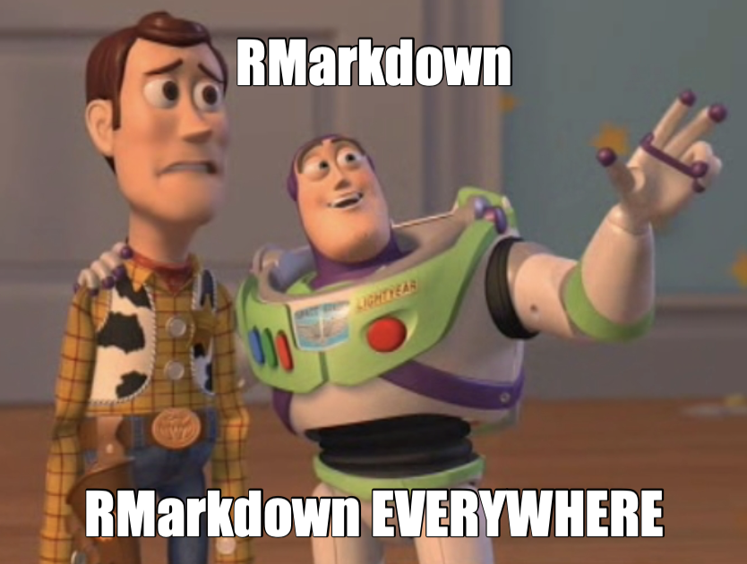

class: title-slide, left, bottom

```{r setup, include = FALSE}
library(knitr)
library(tidyverse)

### Packages not on CRAN ###

# install.packages("remotes")
# remotes::install_github("mitchelloharawild/icon")
library(icon) # icons need to be loaded to view so run following code if not already done
# icon::download_fontawesome()

# install.packages("devtools")
#devtools::install_github("gadenbuie/xaringanExtra")
library(xaringanExtra)
xaringanExtra::use_share_again() # need to get the slide button on html view
xaringanExtra::use_scribble()

# install.packages("devtools")
# devtools::install_github('nhs-r-community/nhsrtheme')
library(nhsrtheme)


# set default options
opts_chunk$set(echo = FALSE,
               fig.width = 7.252,
               fig.height = 4,
               dpi = 300,
               dev.args = list(type = "cairo"),
               eval = TRUE,
               warning = FALSE,
               message = FALSE,
               error = FALSE)

# uncomment the following lines if you want to use the NHS-R theme colours by default
# scale_fill_continuous <- partial(scale_fill_nhs, discrete = FALSE)
# scale_fill_discrete <- partial(scale_fill_nhs, discrete = TRUE)
# scale_colour_continuous <- partial(scale_colour_nhs, discrete = FALSE)
# scale_colour_discrete <- partial(scale_colour_nhs, discrete = TRUE)

```

```{r echo=FALSE}
# Adds logo to all slides

xaringanExtra::use_logo(
  image_url = "https://cdu-data-science-team.github.io/assets//logo/nottshc-logo.jpg",
  exclude_class = c("inverse", "hide-logo"),
  width = "300px",
  height = "200px",
  position = css_position(top = "0em", right = "1em")
)
```

# `r rmarkdown::metadata$title`
----
## **`r rmarkdown::metadata$subtitle`**
### `r rmarkdown::metadata$author` | `r rmarkdown::metadata$date`
</br>
</br>
</br>
</br>

---

class: inverse, middle, center

# Rmarkdown

## more than a (powerful) report maker


---
class: middle, center

# How I started

### NHS-R Community Training

When NHS-R Community 'started' I was told:

--

If you use more code than text use a script

--

If you write more text than code use RMarkdown

--

# Soon changed to...

Use RMarkdown all the time

  for coding and reports

---

class: inverse, center, middle


[](http://cmcr-class.rbind.io/blog/2019/01/22/rmarkdown-everywhere/)

---

# RMarkdown can be used for

 - presentation slides (interactive xaringanExtra::scribble())
 - blogs
 - [training](https://nhs-r-community.github.io/intro_r/) 
 - [interactive apps](https://regionh.shinyapps.io/hais/) (like Shiny called Flexdashboards)
 
--

# RMarkdown is not just R

Crucially, and I never realised this even when using them, it combines languages. I've used:

 * R
 * SQL
 * HTML
 * CSS
 * Markup Language
 * Markdown

---

# Which leads me to blogs

## Why blog?

Started with submitting blogs to [NHS-R Community](https://nhsrcommunity.com/authors/) amongst other established blogging NHS analysts

* some technical
* some wordy

--

# You should have your own website

---

class: center, middle


--

# Lucky to look at the right time because...

---

class: inverse-white, center, middle

[](https://iyo-rstudio-global.netlify.app/)

---

# That got me well and truly started

[](https://hugo-apero-docs.netlify.app/project/)

---

class: inverse-white, center, middle

# Team blog

[](https://cdu-data-science-team.github.io/team-blog/)

???
A site to share

- methodology
- learnings
- principles

---

class: inverse-white, center, middle

# Understanding Your Data

[](https://cdu-data-science-team.github.io/understanding-your-data/)

???
Share publicly

- How we set up the meeting
- What we discussed
- What we aim to do

---

# Benefits of distill

* Pages can be published free through GitHub
* Comprehensive support pages from [RStudio](https://rstudio.github.io/distill/)
* Easy to see how others have created pages as code is open and shared
* Clean layout that is a standard for scientific writing

# Benefits of Hugo Apéro 

* Incredibly flexible and can be much more than a blog site
* The [template](https://github.com/hugo-apero/hugo-apero) is a nice way of setting up a site with minimal effort
* Also easy to see how others have created pages as code is open and shared
* Can be hosted free through services like [Netlify](https://www.netlify.com/)

---

class: inverse

name: acknowledgement

# Acknowledgments

Acknowledgements: the professional look of this presentation, using NHS and Nottinghamshire Healthcare NHS Foundation Trust colour branding, exists because of the amazing work of Silvia Canelón, details of the workshops she ran at the [NHS-R Community conference](https://spcanelon.github.io/xaringan-basics-and-beyond/index.html).

[`r icon::fontawesome("twitter")` @DataScienceNott](https://twitter.com/DataScienceNott)<br/>
[`r icon::fontawesome("github")` Clinical Development Unit Data Science Team](https://github.com/CDU-data-science-team)<br/>
[`r icon::fontawesome("paper-plane")` zoe.turner2@notthshc.nhs.uk](mailto:zoe.turner2@nottshc.nhs.uk)

