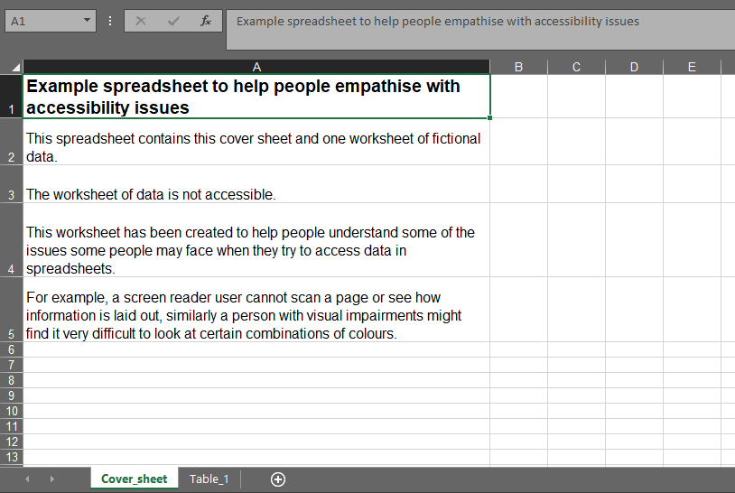
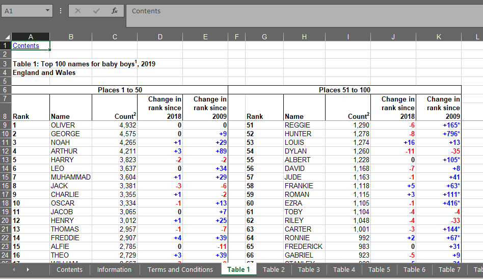
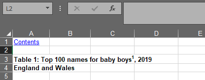
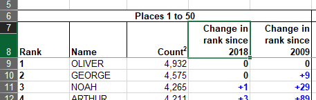
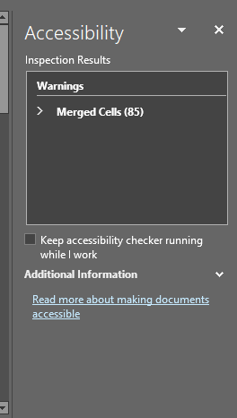
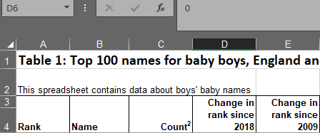
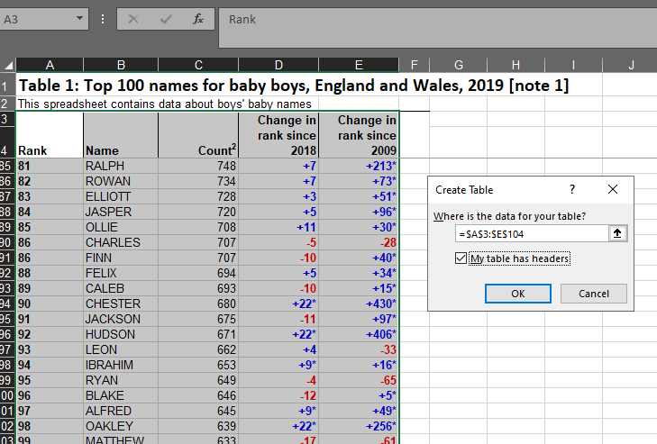
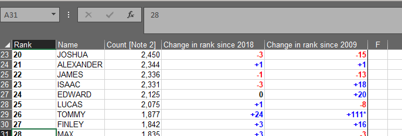
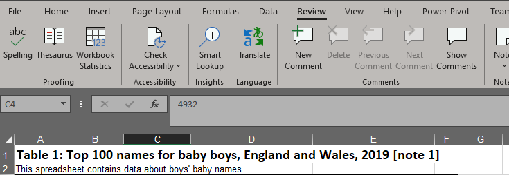

class: title-slide, left, bottom

```{r setup, include = FALSE}
library(knitr)
library(tidyverse)

### Packages not on CRAN ###

# install.packages("remotes")
# remotes::install_github("mitchelloharawild/icons")
library(icons) # icons need to be loaded to view so run following code if not already done
# icons::download_fontawesome()

# install.packages("devtools")
#devtools::install_github("gadenbuie/xaringanExtra")
library(xaringanExtra)
xaringanExtra::use_share_again() # need to get the slide button on html view
xaringanExtra::use_scribble()

# install.packages("devtools")
# devtools::install_github('nhs-r-community/nhsrtheme')
library(nhsrtheme)


# set default options
opts_chunk$set(echo = FALSE,
               fig.width = 7.252,
               fig.height = 4,
               dpi = 300,
               dev.args = list(type = "cairo"),
               eval = TRUE,
               warning = FALSE,
               message = FALSE,
               error = FALSE)

# uncomment the following lines if you want to use the NHS-R theme colours by default
# scale_fill_continuous <- partial(scale_fill_nhs, discrete = FALSE)
# scale_fill_discrete <- partial(scale_fill_nhs, discrete = TRUE)
# scale_colour_continuous <- partial(scale_colour_nhs, discrete = FALSE)
# scale_colour_discrete <- partial(scale_colour_nhs, discrete = TRUE)

```

```{r echo=FALSE}
# Adds logo to all slides

xaringanExtra::use_logo(
  image_url = "https://cdu-data-science-team.github.io/assets/logo/nottshc-cdu-data-science-logo-800.png",
  link_url = "https://cdu-data-science-team.github.io/team-blog/",
  exclude_class = c("inverse", "hide-logo"),
  width = "300px",
  height = "200px",
  position = css_position(top = "0em", right = "0em")
)
```

# `r rmarkdown::metadata$title`
----
## **`r rmarkdown::metadata$subtitle`**
### `r rmarkdown::metadata$author` | `r rmarkdown::metadata$date`
</br>
</br>
</br>
</br>

---
class: inverse, middle, center

# Welcome to Understanding Your Data

This is an informal discussion group where we share our approaches to analysis and discuss all things data.

Notes are written up on our [UYD site](https://cdu-data-science-team.github.io/understanding-your-data/)

Colleagues from outside the organisation have been invited and are very welcome

---
# Information sharing

### Spreadsheet Accessibility

</br>

The public sector have thousands, if not millions, of spreadsheets and not many are accessible.

These slides are a few of the points used to re-format a publicly available spreadsheet

---
class: inverse-white, middle, center

# What is accessible?

Universal access

--

In including everyone we also benefit from universal access

???

Some people use aids to read documents, screen readers, magnifiers, contrast, change the colours. Even dark mode that many apps and programs now offer can make things more accessible and to a wide audience.

Where a document is accessible to a screen reader it will also be machine readable.


---

class: hide-logo

# Further convincing

To help with empathy and understanding of what it's like to navigate a spreadsheet that cannot be 'scanned' visually, the following spreadsheet from [Hannah Thomas' blog](https://gss.civilservice.gov.uk/blog/accessibility-empathy-for-users-of-spreadsheets/) is blacked out and can only be read with navigating up and down the cells.



.footnote[Note that the spreadsheet is in an .ods format which is readable by anyone, even if they don't have Microsoft Office]

???

Hannah Thomas has done a great deal of work on accessibility in spreadsheets. She's written guidance, talked about it and blogged. These slides are notes from her work which is linked to throughout this presentation.

---

class: hide-logo

# Not just about screen readers

Accessibility is about the greatest access for the greatest number of people and that isn't just about having a screen reader.

Some things to try to test accessibility:

--

* Zooming in/use a magnifier - not everyone needs, or wants to use a screen reader

--

* Use non-dominant hand - motor disabilities

--

* Use a keyboard, not mouse - not everyone like or uses a mouse

--

* Try the high contrast mode - helps some visual conditions like cataracts

--

* Listen to something whilst reading (that you don't ordinarily!) - replicates auditory conditions like Tinnitus

--

* Lower the screen’s brightness – replicates the changes needed for glare

---
class: hide-logo

# No requirements for changes

We've never been asked for changes to be made to spreadsheets for accessibility requirements so it means that it isn't needed:

</br>

> "When using the spreadsheet with [screen reader software] JAWS and NVDA I found it to be a pleasant experience. In the past I have found spreadsheets to be extremely confusing, disorientating and stressful. In part this stress came from having to make the document partially accessible for my own needs.
>
>If all spreadsheets were created with as much care and attention to detail, I may not be as reluctant to work with them as I am today."

???

In the webinar Hannah Thomas gave she recalled sending a spreadsheet to the team that checks accessibility on documents and had such positive feedback which just highlighted that by making things inaccessible, we are just excluding people from even knowing what is available. How can anyone ask for something they have never been able to use before?

---

class: hide-logo

### Demonstration

Using the [spreadsheet of boys' baby names](https://www.ons.gov.uk/peoplepopulationandcommunity/birthsdeathsandmarriages/livebirths/datasets/babynamesenglandandwalesbabynamesstatisticsboys) shown in the [YouTube video example](https://www.youtube.com/watch?v=RlihILhpXoE)

Cell A1



???

* A1 is the most important cell in spreadsheet as it's the first cell anyone starts from. 
* Having a hyperlink is ok, nice to have, but it just says contents to a screen reader and isn't essential information. 
* Preferably detail what is in the spreadsheet.

---

# Information in different cells

In this example the details of the spreadsheet...

... is separated....

... from the geography




???

* Consider how long details are in cells and if they run on beyond the cell/table. This will affect users using magnifiers (as well as those on smaller screens like laptops or mobiles).
* Put metadata/information in cover sheets or content sheets. Where information is needed in with a table, put it at the top of it as it helps with navigation keyboard/mouse users and doesn't get missed easily.
* GSS/ONS use title then geography then date.

---

# Superscripts<sup>1</sup>

* Screen readers cannot read them (it sees it as numbers)

* Hard to read because often hard to see

* Advisable to avoid altogether or include at the end in [ ]

-- 

From:

`Table 1: Top 100 names for baby boys1, 2019`

--

To:

`Table 1: Top 100 names for baby boys, 2019 [note 1]`

---

# Mark/tag as headers

Just like in Word

Go to Home ribbon/Styles section/Cell Styles drop down and select Heading 1

--

## Beware!!

Microsoft changes the text colour to blue

--

Suggested change this to Automatic

--

Setting it to black will overwrite someone's own set colours

???

* Required when there is too much glare with black on white for example.

---

## And underlines!!

Microsoft formats Headers with a cell border

--

Best to remove these and avoid underlining 

--

Text has many other things to consider but on this subject, also avoid
_italiced text_


???

Particularly difficult for people with dyslexia

---

# Cell A2

Advised to put an illustrative sentence

--

This is the opportunity to highlight if there are tables lower down the spreadsheet

`This worksheet contains one table. Some cells refer to notes which can be found on the notes worksheet`

--

This is a bit like Alt Text for spreadsheets

--


???

Alternative Text is where people write out what an image is and is used in social media, like Twitter, and is in this presentation slide too where there are images.

The great thing about it is, if the image 'breaks' the alternative text shows to explain what the picture should have been.

---

# Two table layout


* Not easy to read for many
* Not easy to machine read (program)

---

## Just like merged cells

[Accessibility checker](#accessibility-check) in Microsoft highlights merged cells






???

Will mention more about the accessibility checker built into Microsoft later.

---

name: row-height

# Use row height

In order to give space between text...

Use row height, not blank rows



???

A blank row to a screen reader is nothing, there is no anchor to what is coming next, if there is anything. Refer back to Hannah Thomas' spreadsheet to show this as an example where all the cells are blacked out. 

---

# Where is the end of the table?

Sighted users can scan but how do you know otherwise?

You can name your table:

* Highlight the table
* Go to Insert/Table
* Ensure "My table has headers" is selected
* Remove formatting in Table Design ribbon/Table Styles



???

Think of magnification too, so if someone has zoomed in to read a section, they won't know how big the table is.

The resetting of Microsoft automatic formatting can be set up on the computer(s) being used. 

Although it takes time to reset manually, it is a reminder of what individuals will have to do repeatedly if spreadsheets are provided to be visually appealing and not for function.

---

# Other uses of tables

* Possible to use tab to navigate (moves to the next row of table)
* Tables can be named (in Table Design)
* Ctrl + G (Go To) give hyperlinks between tables like a table of contents
* If the freeze pane formatting is removed, the columns retain their naming



---

# Text formats

* Bold is ok, just not overused

--


* Mixed case is preferable (=PROPER() in Excel)

--

* Colour can be used for emphasis (never alone)

--

* [Check for colour contrasts](https://gss.civilservice.gov.uk/policy-store/releasing-statistics-in-spreadsheets/#section-10) if colour is used

--

* Red is a particular colour that causes issues
* RGB code:(179,0,0) and hex code: #B30000

--

* Use sans serif font (Arial)

???

All capitals are harder to read for many but also for people with dyslexia. 

Some words may be read by screen readers as acronyms.

[NHS branding](https://www.england.nhs.uk/nhsidentity/identity-guidelines/fonts/) uses Frutiger which is licenced and the secondary font is Arial which free. 

---

# Notes and footnotes

* Notes under a table can get missed

--

* Use a separate worksheet/tab

--

* Give thought to the notes formatting (put them in a table)


???

A side effect of having notes in one place is that it saves having to change something if it is repeated across multiple tabs. The example spreadsheet has has 8 tabs for example and all say "Source: Office for National Statistics (ONS)" at the bottom of the tables


---

# Freeze panes

It's advised to avoid as they can take up a lot of space (magnifiers)

If they are necessary include a note with the spreadsheet about how to remove them:

> For example: ‘Freeze panes are turned on. To turn off freeze panes select the ‘View’ ribbon then ‘Freeze Panes’ then ‘Unfreeze Panes’ or use [Alt W, F]’.

Freezing panes was mentioned in the [row height slide](#row-height) 

???

Note that the directions to remove include both a keyboard shortcut and how to navigate it using a mouse. 

---

name: accessibility-check

# Accessibility check

Like the grammar/spell check...




???

Microsoft checks, like spelling and grammar and now accessibility are useful but not still require some caution from the user. Spell checker doesn't pick up that I keep typing Understating Your Data not Understanding Your Data!

---

class: inverse

name: acknowledgement

# Acknowledgments

Acknowledgements: the professional look of this presentation, using NHS and Nottinghamshire Healthcare NHS Foundation Trust colour branding, exists because of the amazing work of Silvia Canelón, details of the workshops she ran at the [NHS-R Community conference](https://spcanelon.github.io/xaringan-basics-and-beyond/index.html), Milan Wiedemann who created the CDU Data Science logo with the help of the team and Zoë Turner for putting together the slides.

Thanks to [Government Statistical Service](https://gss.civilservice.gov.uk/policy-store/releasing-statistics-in-spreadsheets/#section-10) for producing guidance and in particular to [Hannah Thomas](https://twitter.com/statshan?lang=en) for disseminating this information in various forms. 

[`r icons::fontawesome("twitter")` @DataScienceNott](https://twitter.com/DataScienceNott)<br/>
[`r icons::fontawesome("github")` Clinical Development Unit Data Science Team](https://github.com/CDU-data-science-team)<br/>
[`r icons::fontawesome("paper-plane")` cdudatascience@nottshc.nhs.uk](mailto:cdudatascience@nottshc.nhs.uk)

