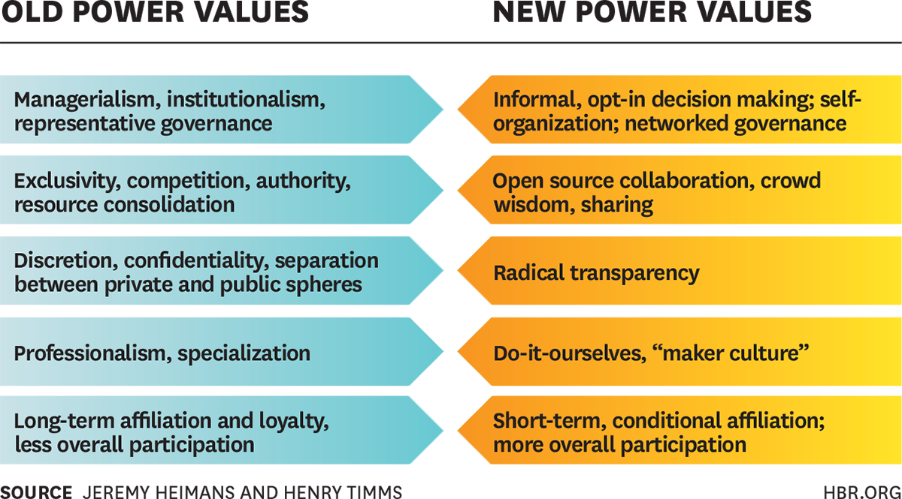

class: title-slide, left, bottom

```{r setup, include = FALSE}
library(knitr)
library(tidyverse)

### Packages not on CRAN ###

# install.packages("remotes")
# remotes::install_github("mitchelloharawild/icons")
library(icons) # icons need to be loaded to view so run following code if not already done
# icons::download_fontawesome()

# install.packages("devtools")
#devtools::install_github("gadenbuie/xaringanExtra")
library(xaringanExtra)
xaringanExtra::use_share_again() # need to get the slide button on html view

# install.packages("devtools")
# devtools::install_github('nhs-r-community/nhsrtheme')
library(nhsrtheme)


# set default options
opts_chunk$set(echo = FALSE,
               fig.width = 7.252,
               fig.height = 4,
               dpi = 300,
               dev.args = list(type = "cairo"),
               eval = TRUE,
               warning = FALSE,
               message = FALSE,
               error = FALSE)

```

```{r echo=FALSE}
# Adds logo to all slides

xaringanExtra::use_logo(
  image_url = "https://raw.githubusercontent.com/nhs-r-community/assets/main/logo/nhsr-logo.svg",
  link_url = "https://nhsrcommunity.com/",
  exclude_class = c("inverse", "hide-logo"),
  width = "300px",
  height = "200px",
  position = css_position(top = "0em", right = "0em")
)
```

# `r rmarkdown::metadata$title`
----
## **`r rmarkdown::metadata$subtitle`**
### `r rmarkdown::metadata$author` | `r rmarkdown::metadata$date`
</br>
</br>
</br>
</br>

---
class: inverse, center, middle

# Start with a story...

---
class: middle

.pull-left[


]

???
We can see the success of producing tools for SPCs like:

* NHSE/I Excel spreadsheet
* SQL 
* and now the {NHSRplotthdots} package


--
.pull-right[

But I want to tell you today about how the R package came to be.

My view of this is from:

* joining in the meetings, 
* contributing by asking questions, 
* and not writing very much code at all.
]
???

Contributors can be seen on the [repository](https://github.com/nhs-r-community/NHSRplotthedots/graphs/contributors)

---
class: inverse, center, middle

# ... from from a given point

---
class: middle

.pull-left[

]

???
We often start from a blank piece of paper where things are planned out.

--

.pull-right[
Many in the group who contributed to the code had written the SPC code for their own work already. 

There were:

* reports and 
* dashboards 

that had been started and whilst we had all used existing packages like:

* [{qicharts2}](https://cran.r-project.org/web/packages/qicharts2/vignettes/qicharts2.html) 
* [{spccharter}](https://github.com/johnmackintosh/spccharter)
* [{runcharter}](https://github.com/johnmackintosh/runcharter)
]

---
class: inverse, center, middle

# Next step - get together

---
class: middle

.pull-left[

]

???

It's pretty symbolic that when we refer to getting together 
that the images we have are with people being in the same room together! 

--

.pull-right[
We met virtually and that opens up the possibility of who can get involved

Skills and experiences weren't assessed to join in

Contributions were always received gratefully and never "expected"

]


---
class:center, middle, inverse

# GitHub

---
class: middle

.pull-left[
<p>
 <a href="https://github.com/nhs-r-community">
 
 </a>
</p>
]

???

For those who are unfamiliar with this symbol, it's GitHub, a site where code can be stored publicly and privately for:

* collaboration
* version control


--

.pull-right[
You don't have to meet to work collaboratively

The NHS-R Community have an open [repository](https://github.com/nhs-r-community/NHSRplotthedots) to view code and contribute:

* write code 
* or raise [issues](https://github.com/nhs-r-community/NHSRplotthedots/issues).

All you need is an account.

]

???

Using GitHub is quite new for many and can be quite daunting. 

My first introduction to it was several years ago.

I got a lot of help to contribute to the [{NHSRdatasets}](https://github.com/nhs-r-community/NHSRdatasets) package from... guessed it yet?... the NHS-R Community.

---
class: center, middle, inverse

# Who are NHS-R Community?

---
class: middle

.pull-left[

]

--

.pull-right[
Would it surprise you to hear that it's you

It's us because that's what a community is

It exists because of us all.
]

---
class: inverse, middle, center

# Breaking tradition

### Openness and transparency

---
class: middle

# Harvard Business Review

### Understanding "New Power"

.pull-left[

]

.pull-right[
* **Informal** - we don't have any direction. I've personally never been told "no" and there has always been encouragement to "have a go"
* **Open source** - we use GitHub, communicate through Slack, ask questions directed to everyone
* **Radical transparency** - using GitHub. It can look like those who are doing it are experts - they aren't, they've just been having a go a bit longer
* **Do-it-ourselves** - the package wasn't funded (it could have been), we just got on and tried it out and it worked
* **Short-term affiliation** - we all work in different organisations with the only thing binding us is the community 

]

???
In 2014 there was an article about power written in the context then of a perceived shift in power through politics in countries like Egypt. 

A lot has changed since then, of course, but some things highlighted in that article resonate in the NHS-R Community:

> What’s distinctive about these participatory behaviors is that they effectively “upload” power from a source that is diffuse but enormous—the passions and energies of the many.


---
class: inverse

name: acknowledgement

# Acknowledgments

Acknowledgements: the professional look of this presentation, using NHS and Nottinghamshire Healthcare NHS Foundation Trust colour branding, exists because of the amazing work of Silvia Canelón, details of the workshops she ran at the [NHS-R Community conference](https://spcanelon.github.io/xaringan-basics-and-beyond/index.html). 

Images are from [Pixabay](https://pixabay.com/) released under the Pixabay License, which makes them safe to use without asking for permission or giving credit to the artist - even for commercial purposes.

[`r icons::fontawesome("twitter")` @NHSRCommunity](https://twitter.com/NHSRCommunity)<br/>
[`r icons::fontawesome("github")` NHS-R Community](https://github.com/nhs-r-community)<br/>
[`r icons::fontawesome("paper-plane")` nhs.rcommunity@nhs.net](nhs.rcommunity@nhs.net)

