class: title-slide, left, bottom

```{r setup, include = FALSE}
library(knitr)
library(tidyverse)

### Packages not on CRAN ###

# install.packages("remotes")
# remotes::install_github("mitchelloharawild/icons")
library(icons) # icons need to be loaded to view so run following code if not already done
# icons::download_fontawesome()

# install.packages("devtools")
#devtools::install_github("gadenbuie/xaringanExtra")
library(xaringanExtra)
xaringanExtra::use_share_again() # need to get the slide button on html view

# set default options
opts_chunk$set(echo = FALSE,
               fig.width = 7.252,
               fig.height = 4,
               dpi = 300,
               dev.args = list(type = "cairo"),
               eval = TRUE,
               warning = FALSE,
               message = FALSE,
               error = FALSE)

```

```{r echo=FALSE}
# Adds logo to all slides

xaringanExtra::use_logo(
  image_url = "https://cdu-data-science-team.github.io/assets/logo/nottshc-cdu-data-science-logo-800.png",
  link_url = "https://cdu-data-science-team.github.io/team-blog/",
  exclude_class = c("inverse", "hide-logo"),
  width = "300px",
  height = "200px",
  position = css_position(top = "0em", right = "0em")
)
```

# `r rmarkdown::metadata$title`
----
## **`r rmarkdown::metadata$subtitle`**
### `r rmarkdown::metadata$author` | `r format(Sys.time(), '%B %Y')` 

---
class: inverse, middle, center

# Ethics

### What's it got to do with data analysis?

---
class: inverse-white, middle

# Why ethics?

--

* Ethics is just for research/Artificial Intelligence

--

* It's never been a part of my work

--

* Ethics committees are for medical cases

--

* There are procedures that cover this, surely

--

* Are there even any consequences if something is unethical?

---

class:center

# I'm a good person 

--

I know what I'm doing is ok

--


---

class: inverse

# Scenario 1 

## Freedom of Information request

.pull-left[


]

.pull-right[

A question was asked last year about waiting times for a service and a figure was provided.


A similar question was asked this year and a different analyst looked at the code. It was slightly wrong so the number produced is very different. 


Do you:

a) use the old code  
b) use the new code

]


---

# Right answer?

.pull-left[

]
--

.pull-right[
What do we do when there are no clear right or wrong answers? 


Do we only find out the answer was wrong after it's caused damage?


When do we even find out if we've caused damage?
]
---

# COSHH Pictograms  


.pull-left[

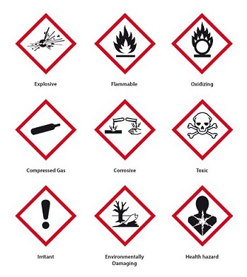

]


.pull-right[

</br>
Pictograms alert us to the presence of hazardous chemicals. 

These are not saying "Don't use"  

Giving a warning to take precautions

]

---

class: inverse, center, middle

# Wouldn't that be handy for data!

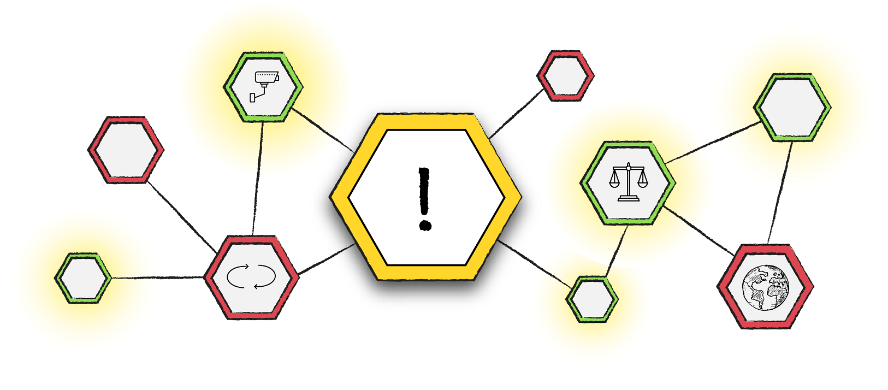

---

# Introducing Data Hazards


--

* A starting point

--

* Open source - open contribution

--

* Invite other views on a project


---

# When to use them

--

* Thinking about worst case scenarios

--

* Might use all or most of the hazard labels

--

* Not just for the project but ways in which others might use it

---
class: inverse, middle, center

# Scenario 1 - revisited

---

class: hide-logo

# [General hazard](https://datahazards.com/contents/hazards/general-hazard.html)

.pull-left[
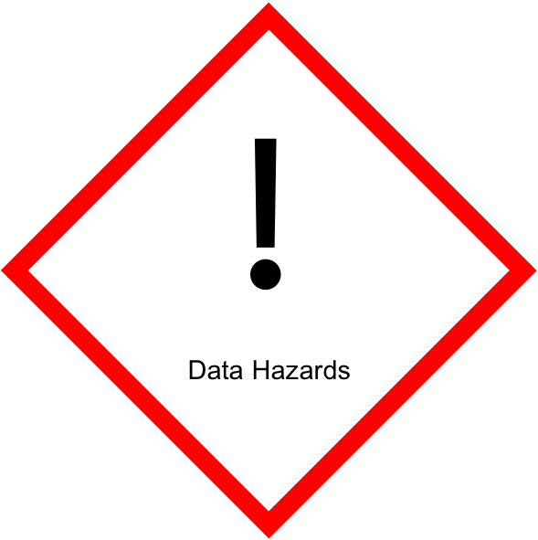
]

--

.pull-right[
Issues:  

Misunderstanding/misinterpretation  
Errors, changes in methodology  
We don't know what happens to the request after its made.  

--

Precautions:  

Mitigate with a caveat of data changing?  
Issue corrections publicly?  
Share methodology and update it if changes? 
]
---

class: hide-logo

# [Reinforce Existing bias](https://datahazards.com/contents/hazards/reinforces-biases.html)

.pull-left[
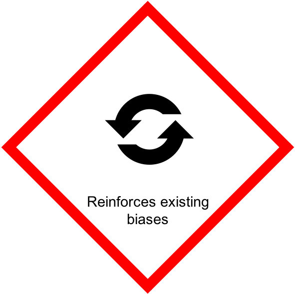

]

--

.pull-right[

Issues:  

Hard to say as the service wasn't mentioned in the scenario but could an incorrect number have been accepted because of bias?  

Could reusing it reinforce that bias?

--

Precautions:

Although the Freedom of Information related to one service, could this be extended to other services to see if there is bias between services and/or certain groups.
]
---

class: hide-logo

# [Ranks or classifies people](https://datahazards.com/contents/hazards/ranks-classifies.html)

.pull-left[
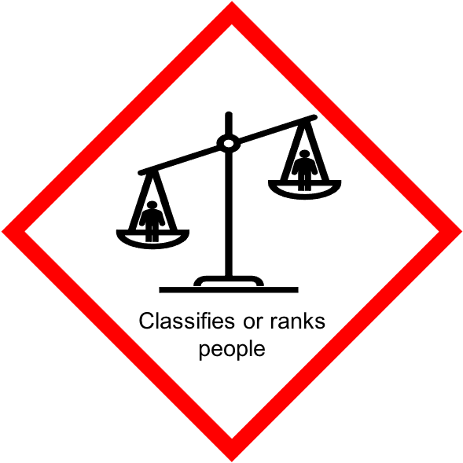
]

--
.pull-right[

Issues:
Could the data also be requested of multiple Trusts to be compared now or could be in the future?

--

Precautions:
Publish the methodology and/or code for other Trusts to replicate or audit if required.
]
---

class: hide-logo

# [High Environmental Cost](https://datahazards.com/contents/hazards/high-environmental-cost.html)

.pull-left[
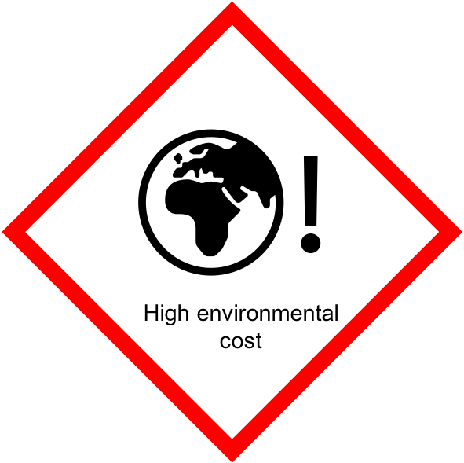
]
--

.pull-right[
Issues:
Was it quick code to run or resource hungry?  

Is the data part of a larger data set that is replicated across Trusts (HES data for example) and needs big storage?

--

Precautions:
Code reviews to ensure code is not unnecessarily resource hungry. 
]
---

class: hide-logo

# [Lacks community involvement](https://datahazards.com/contents/hazards/lacks-community-involvement.html)

.pull-left[
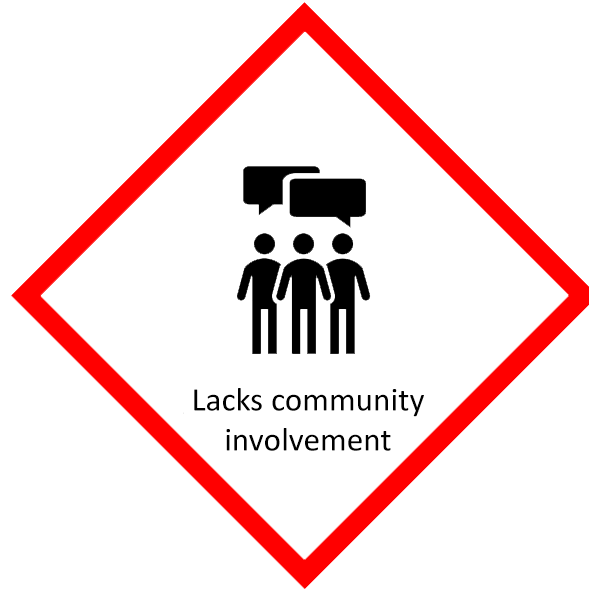
]
--

.pull-right[

Issues:
Generally these data requests are not checked with the community. But is that necessary?

Freedom of Information requests are also published by Trusts or public sites like [What do they Know](https://www.whatdotheyknow.com/) 

--

Precautions:
Could some Freedom of Information requests become analyses in their own right?  

For example, a question that highlights a data gap like smoking cessation used for patients who are under 16 in mental health services highlighted data on smoking status is poorly recorded. Could we escalate the poor data?
]
---

class: hide-logo

# [Danger of misuse](https://datahazards.com/contents/hazards/danger-of-misuse.html)

.pull-left[
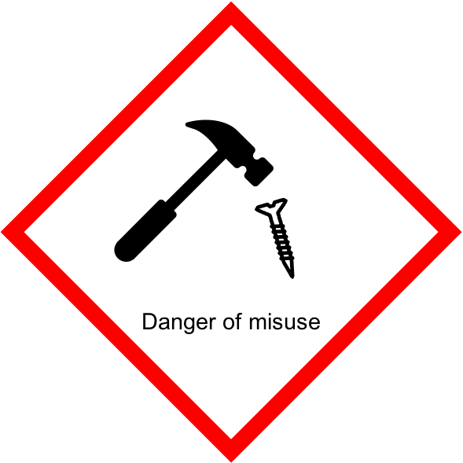
]
--

.pull-right[

Issues:
Perhaps a hazard for all Freedom of Information as we don't know what happens to the request. 

--

Precautions:
Could we mitigate by sharing and publishing methodology/code?
]
---

class: hide-logo

# [Difficult to understand](https://datahazards.com/contents/hazards/difficult-to-understand.html)

.pull-left[
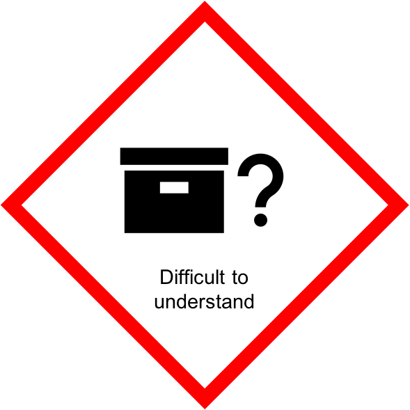
]
--

.pull-right[
Issues:
Was the question itself difficult to understand?  

The code was wrong so does that introduce difficulty?

--

Precautions:
Providing data with a caveat that it is possible it could change.

Sharing code/methodology.
]
---

class: hide-logo

# [May cause direct harm](https://datahazards.com/contents/hazards/direct-harm.html)

.pull-left[
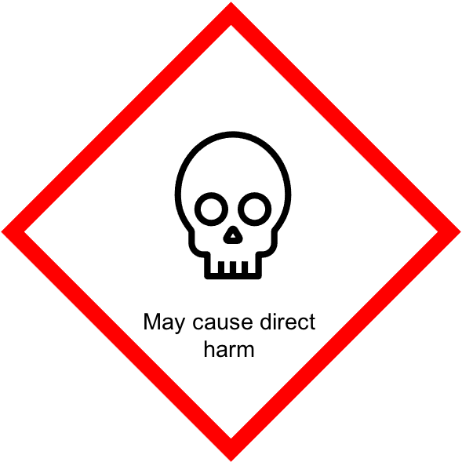
]
--

.pull-right[
Issues:
Difficult to say what this could be?

]
---

class: hide-logo

# [Risk to privacy](https://datahazards.com/contents/hazards/risk-to-privacy.html)

.pull-left[
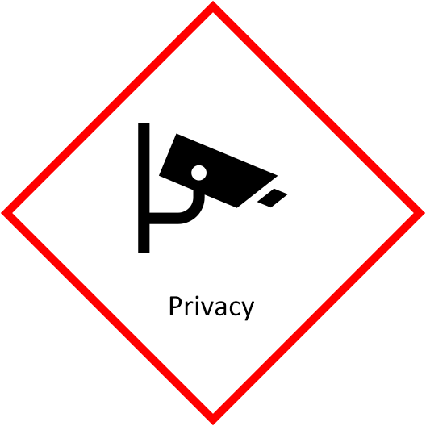
]
--

.pull-right[
Issues:
Possibly not as data is scrutinised by Information Governance often for identifiable data.

]

---

class: hide-logo

# [Automates decision making](https://datahazards.com/contents/hazards/automates-decision-making.html)

.pull-left[
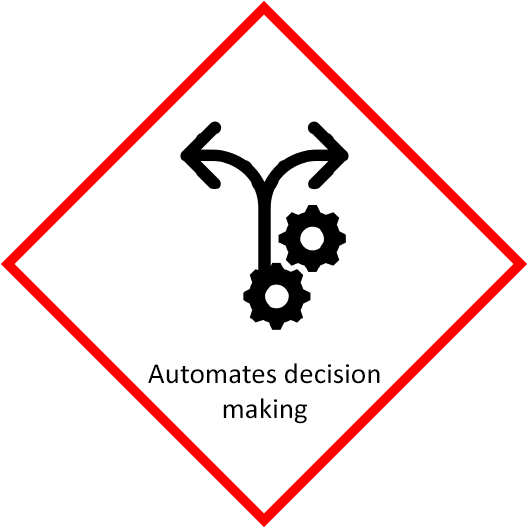
]

--

.pull-right[
Issues:
Possibly not as the data is re-run as requested, and an error was identified so doesn't suggest any automation.

]
---

class: hide-logo

# [Lacks informed Consent](https://datahazards.com/contents/hazards/lacks-informed-consent.html)

.pull-left[
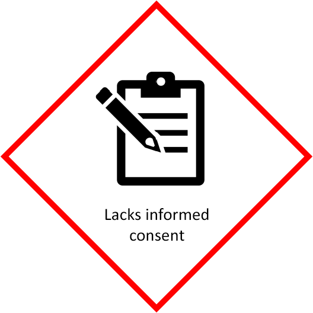
]
--

.pull-right[

Issues:
Data is often about the service, not the patients so are service audits rather than research.
]

---

# More Ethics Resources

--

* Bristol University have a virtual [Data Ethics Club](https://dataethicsclub.com/)  

[The next meeting](https://dataethicsclub.com/join_in/meetings/2022/09-sep/21-09-22_meeting.html) will discuss “Hacking the Cis-tem”, which is an article about transgender Britons who tried to correct the gender listed on their government-issued ID cards, but were limited by computerised systems.  

--

* Civil Service have an [awareness online course](https://gss.civilservice.gov.uk/training/awareness-in-data-ethics/)

--

* UK Statistics Authority have an [Ethics Self-Assessment Tool](https://uksa.statisticsauthority.gov.uk/the-authority-board/committees/national-statisticians-advisory-committees-and-panels/national-statisticians-data-ethics-advisory-committee/ethics-self-assessment-tool/)

--

* [Government Data Science Slack](govdatascience.slack.com) have an Ethics channel and 

--

[Data ethics and society reading group](https://github.com/alphagov/data-ethics-and-society-reading-group) for cross government sessions on books and articles relating to ethics in data science

---

class: inverse

# Scenario 2  

## Did not attend analysis

.pull-left[

Use [templates](#templates) to go through the Hazards


]

.pull-right[

Did not attends cost the NHS in money, lost opportunity and staff time. It's analysis that is asked of analysts/data scientist, particularly in view of demographics and population health management.  

The analysis question posed is: Are some groups more like to not attend than others? 

]
---

class: inverse

# Scenario 3  

## Dashboard analysis

.pull-left[

Use [templates](#templates) to go through the Hazards


]

.pull-right[

A dashboard is requested which needs to include demographics, service information and some time related information. It needs to be high level but possible to drill down to lower but not to actual patient data.

]

---
name: templates
class: inverse, middle, center

The following slides are the individual Data Hazard labels to prompt discussion or the [Word template](https://very-good-science.github.io/data-hazards/_static/data_hazards_template.docx)

---

class: hide-logo

# [General hazard](https://datahazards.com/contents/hazards/general-hazard.html)

.pull-left[

]

.pull-right[

Issues:

Precautions:
]

---

class: hide-logo

# [Reinforce Existing bias](https://datahazards.com/contents/hazards/reinforces-biases.html)

.pull-left[


]


.pull-right[

Issues:

Precautions:
]
---

class: hide-logo

# [Ranks or classifies people](https://datahazards.com/contents/hazards/ranks-classifies.html)

.pull-left[

]

.pull-right[

Issues:

Precautions:
]
---

class: hide-logo

# [High Environmental Cost](https://datahazards.com/contents/hazards/high-environmental-cost.html)

.pull-left[

]

.pull-right[

Issues:

Precautions:
]
---

class: hide-logo

# [Lacks community involvement](https://datahazards.com/contents/hazards/lacks-community-involvement.html)

.pull-left[

]

.pull-right[

Issues:

Precautions:
]

---

class: hide-logo

# [Danger of misuse](https://datahazards.com/contents/hazards/danger-of-misuse.html)

.pull-left[

]

.pull-right[

Issues:

Precautions:
]
---

class: hide-logo

# [Difficult to understand](https://datahazards.com/contents/hazards/difficult-to-understand.html)

.pull-left[

]

.pull-right[

Issues:

Precautions:
]
---

class: hide-logo

# [May cause direct harm](https://datahazards.com/contents/hazards/direct-harm.html)

.pull-left[

]

.pull-right[

Issues:

Precautions:
]

---

class: hide-logo

# [Risk to privacy](https://datahazards.com/contents/hazards/risk-to-privacy.html)

.pull-left[

]

.pull-right[

Issues:

Precautions:
]
---

class: hide-logo

# [Automates decision making](https://datahazards.com/contents/hazards/automates-decision-making.html)

.pull-left[

]

.pull-right[

Issues:

Precautions:
]
---

class: hide-logo

# [Lacks informed Consent](https://datahazards.com/contents/hazards/lacks-informed-consent.html)

.pull-left[

]

.pull-right[

Issues:

Precautions:
]

---

class: inverse

name: acknowledgement

# Acknowledgments

Special thanks to: Zelenka, N., & Di Cara, N. H. Data Hazards (Version 0.1) [Computer software]. https://github.com/very-good-science/data-hazards

Acknowledgements: the professional look of this presentation, using NHS and Nottinghamshire Healthcare NHS Foundation Trust colour branding, exists because of the amazing work of Silvia Canelón, details of the workshops she ran at the [NHS-R Community conference](https://spcanelon.github.io/xaringan-basics-and-beyond/index.html), Milan Wiedemann who created the CDU Data Science logo with the help of the team and Zoë Turner for putting together the slides.

[`r icons::fontawesome("twitter")` @DataScienceNott](https://twitter.com/DataScienceNott)  
[`r icons::fontawesome("github")` Clinical Development Unit Data Science Team](https://github.com/CDU-data-science-team)  
[`r icons::fontawesome("paper-plane")` cdudatascience@nottshc.nhs.uk](mailto:cdudatascience@nottshc.nhs.uk)

Photos (in order of appearance):

Photo by Tara Winstead: https://www.pexels.com/photo/blue-puzzle-piece-on-white-jigsaw-puzzle-8386126/  
Photo by Olya Kobruseva: https://www.pexels.com/photo/question-marks-on-paper-crafts-5428833/  
Photo by Tara Winstead: https://www.pexels.com/photo/red-check-mark-on-box-in-close-up-view-8850709/  
Photo by fauxels: https://www.pexels.com/photo/people-having-business-meeting-together-3183183/  
Photo by Pixabay: https://www.pexels.com/photo/calendar-dates-paper-schedule-273153/  
Photo by Lukas: https://www.pexels.com/photo/close-up-photo-of-gray-laptop-577210/